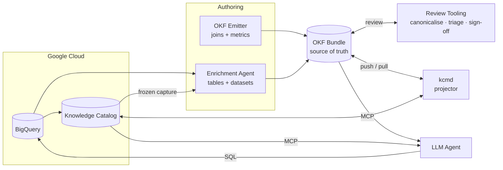
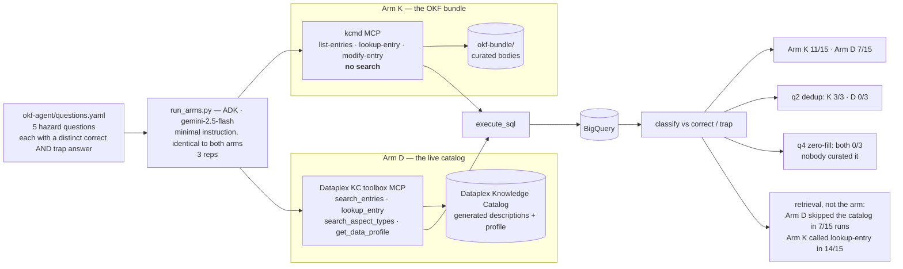

# ARCHITECTURE — `v6z-okf-projector`

The [README](README.md) diagram describes the *upstream* demo: one CLI, one
bundle, `pull` → enrich → `push`. This branch keeps that spine and adds four
things around it — a **frozen capture** to ground authoring, **two producers**
that write the bundle, a **review surface** between authoring and projection,
and a **measurement harness** that reads the result back. This file is the
as-built picture.

Read [RESULTS.md](RESULTS.md) for what the measurements concluded,
[MEASUREMENTS.md](MEASUREMENTS.md) for the raw evidence, and
[HANDOFF.md](HANDOFF.md) for how to run any of it.

---

## 1. The projection pipeline

The **enrichment agent** and the **emitter** are two producers, deliberately:
the emitter is deterministic and owns joins/metrics, the agent is an LLM and
owns tables/datasets. Every concept records which one wrote it. **kcmd** is the
only component that talks to the catalog, in both directions — the push is a
full replace, and the pull is what makes the bundle's authority checkable rather
than asserted.

### What each arrow costs you

| Hop | The thing that is easy to get wrong |
|---|---|
| 2. freeze | The LLM-backed half of a capture is **not** reproducible — two runs over byte-identical data gave 18 joins then 12, two direction-flipped. Freezing is what makes everything downstream comparable. |
| 3b. author | Stock `BigQuerySource` sees **no Dataplex metadata at all**. `KCBigQuerySource` is the subclass that merges `kc-capture/` into `read_concept`. |
| 4a. push | `push --validate-only` is **not** a dry run in this fork — it creates every entry it "validates". |
| 4a. push | The aspect write is a **full replace**, not a merge. A field deleted from the bundle is deleted from the catalog. That is what makes the bundle authoritative. |
| 5. pull | Writes under `catalog/<entryGroup>/<project>/<location>/…`, not the bundle's bare paths. Pull into a **scratch** tree, never over `catalog/`. |
| review | The canonicaliser is a **required post-authoring step** — `reference_agent` writes non-canonical frontmatter every time. |

### Three things that do not survive the round trip

- **`index.md` × 6** — no frontmatter → no entry name → no entry. The bundle's
  navigation layer has no representation in the catalog.
- **Duplicate tags** — Dataplex stores tags as a label *map*.
- **The body**, until the asymmetric-alias workaround in `pull.ts`.

---

## 2. The Phase 8 evaluation harness

Not in the upstream diagram at all. Two arms over the **same** warehouse and the
**same** deliberately minimal instruction; the metadata channel is the only
intended variable.

**The confound is load-bearing and is reported, not buried.** Arm K's MCP has no
search; Arm D's does. That is a property of the two MCP servers, not of the
metadata behind them — so the score gap is *not* evidence for OKF. The claim the
evidence actually supports is narrower: a thin tool surface that **forces**
retrieval beat a rich one that **permits** skipping it.

---

## 3. What changed relative to the README diagram

| README diagram | This branch |
|---|---|
| `kcmd CLI` pulls BQ + Dataplex straight into the bundle | A **frozen, hash-manifested capture** (`kc-capture/`) sits in between, because the relationship scan is non-deterministic |
| One enrichment step: "Data Steward or AI" | **Two producers with recorded provenance** — a deterministic emitter for joins/metrics, an LLM author for tables/datasets — and the bundle records which wrote each concept |
| Bundle → `kcmd` → Catalog | Same spine, but through **our shim** (`kcmd/demo/okf/`), which works around two fork defects; `kcmd/src/` is untouched |
| — | A **review surface**: canonicaliser, join triage against JT1–JT4, and a half-flagged sign-off whose unflagged half is the control |
| — | **Two projection tracks**: Track B (concepts into a new EntryGroup) and Track A (the `okf` aspect onto the existing `@bigquery` entries) |
| — | **A read-back loop** — pull, canonical diff, re-scan — that is where every finding came from |
| Cloud Run `kcmd-sync-service` automates pull/push | **Not exercised on this branch.** The service still ships; every run here was manual and single-writer. Multi-writer conflict against full-replace semantics is untested. |

---

## 4. The failure mode this architecture is shaped around

> **Silent plausible success.** Fork defect 1 produced a `push` that reported
> success over an empty index. Fork defect 2 produced a `pull` that returned 53
> concepts with empty bodies. The same defect on the read path produced a
> **scored agent arm** that read an empty catalog and lost a question.

Three times the system reported success and the output looked reasonable.
Nothing failed loudly. Every one was caught only by **counting something** —
which is why the diagram above has a read-back loop rather than just a push.
