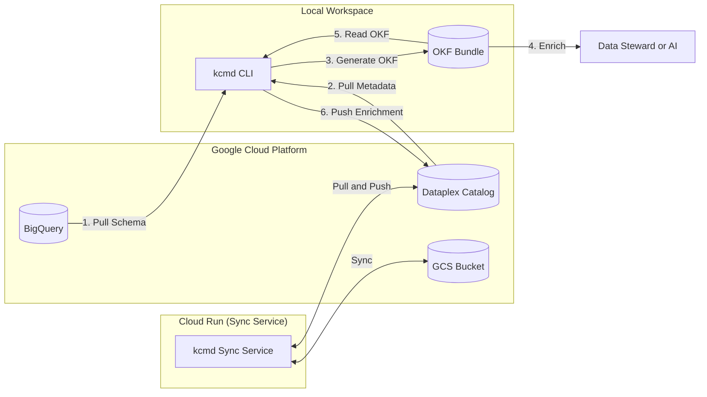

# Open Knowledge Format (OKF) Metadata Demo

This project demonstrates how to manage BigQuery metadata as code using the **Open Knowledge Format (OKF)** and `kcmd`.

It shows how to extract BigQuery table schemas and Dataplex metadata into a local, version-controlled OKF bundle (Markdown files with YAML frontmatter), enrich it, and synchronize it back to the Google Cloud Dataplex Knowledge Catalog.

> **This README describes the upstream demo.** The `v6z-okf-projector` branch
> takes it considerably further — the bundle becomes the *source of truth*, the
> catalog becomes a projection of it, and a differ reports when the two
> disagree. Everything below still holds; `docs/` is where the as-built system
> is written down.

## Where to start

Five documents, split by **kind** rather than by topic, so each has one job.
**Read them in this order** — each assumes the one before it.

| # | document | what it is for | read it when |
|---|---|---|---|
| 1 | **[docs/DESIGN.md](docs/DESIGN.md)** | **Start here.** What exists, why it is shaped this way, and what was wrong with the tooling underneath: the model, the three ownership tiers, the differ, the direction of authority, the kcmd defects, the verification commands, the known gaps. | always |
| 2 | [docs/RESULTS.md](docs/RESULTS.md) | The conclusions. Does this work, is it worth using, and which claims are measured **false**. §7 corrects three that did not survive scrutiny. | deciding whether to adopt any of this |
| 3 | [docs/ARCHITECTURE.md](docs/ARCHITECTURE.md) | The as-built diagrams, what each hop costs you, and the Phase 8 evaluation harness. A companion to DESIGN, not a second home for the reasoning. | you want the picture rather than the prose |
| 4 | [docs/HANDOFF.md](docs/HANDOFF.md) | Operational state: environment, credentials, the exact commands, what is done, what is next, and any blocker in symptom → ruled-out → prime-suspect → ways-forward form. | you are about to **run** something |
| 5 | [docs/MEASUREMENTS.md](docs/MEASUREMENTS.md) | The raw evidence log, append-only. Every "measured" claim in the other four cites it. Long, and not meant to be read front to back. | you want to check a number |

There is no separate forward plan: what remains open is **DESIGN §12, Known
gaps**.

**All commands in those documents are written to run from the repository root**,
not from `docs/`.

## Architecture



## Flow

1.  **Initialize**: Set up a workspace targeting a BigQuery dataset (pre-configured in `bq-okf-workspace/catalog.yaml` for this demo; typically runs `kcmd init`).
2.  **First-time Pull (Extract)**: Run the pull command (see [Setup Step 4](#4-sync-metadata)) to extract table schemas from BigQuery and existing metadata from Dataplex, generating the initial OKF Markdown files in the local `bundle/` directory.
3.  **OKF Representation**: Metadata is stored as Markdown files (one per table/dataset) with YAML frontmatter containing system metadata (schemas, resource names) and a Markdown body for human-readable overviews.
4.  **Enrichment**: Edit the Markdown files (locally or via automated processes) to document tables and columns.
5.  **Push (Publish)**: Use `kcmd` to publish the enrichments back to Dataplex Knowledge Catalog.
6.  **Automated Sync**: (Optional) Deploy `kcmd-sync-service` to Cloud Run to automate this pull/push process triggered by GCS or BigQuery events.

## Repository Structure

-   `docs/`: The as-built documentation for this branch — see **Where to start** above.
-   `okf-bundle/`: **The source of truth.** A clean OKF v0.2 bundle, tool-agnostic, in git.
-   `okf-emitter/`, `okf-author/`: the two producers that write the bundle.
-   `okf-review/`: conformance, canonicalisation, the post-authoring pass, and the
    tier-A mirror. All have a `--check` mode so CI can assert the bundle is final.
-   `okf-agent/`: the Phase 8 evaluation harness (Arm K vs Arm D).
-   `kc-capture/`: a frozen, hash-manifested capture of Knowledge Catalog, used as
    reproducible *input* to authoring — never as a source of truth.
-   `bq-okf-workspace/`: The local metadata catalog workspace.
    -   `catalog.yaml`: Configuration defining the scope of metadata to sync (parameterized).
    -   `bundle/`: The local cache of metadata (Markdown files in OKF format) synced from Dataplex.
-   `kcmd/`: The "Knowledge Catalog Metadata as Code" library and CLI tool.
    -   Provides the CLI to `pull` and `push` metadata.
    -   Provides the MCP server implementation.
-   `kcmd-sync-service/`: A helper service (designed for Cloud Run) to automate the syncing of metadata (pull/push) triggered by Pub/Sub or GCS events.
-   `bq-kc-agent/`: (Optional) An AI Agent application built with Agent Development Kit (ADK) that can consume the metadata via MCP.

## GCP Resources Required

To run this demo, you need the following GCP resources:

1.  **BigQuery Dataset & Tables**:
    *   A dataset containing the tables you want to query.
    *   For the demo, you can copy public GA4 sample data (see Setup).
2.  **Dataplex (Knowledge Catalog)**:
    *   BigQuery datasets and tables are automatically indexed by Dataplex.
3.  **GCS Bucket**:
    *   **Required for automated sync**: Used by `kcmd-sync-service` as the central repository to store the OKF metadata snapshot (since Cloud Run is stateless).
    *   **Optional for local-only development**: You can run and test everything locally using your local filesystem.
4.  **Service Account**:
    *   Needs permissions to query BigQuery (`roles/bigquery.admin` or `roles/bigquery.dataViewer` + `roles/bigquery.user`).
    *   Needs permissions to read Dataplex Catalog (`roles/dataplex.viewer` or `roles/dataplex.catalogViewer`).
    *   Needs GCS access (`roles/storage.objectAdmin`) if using the sync service.

## Prerequisites

-   Google Cloud Project with BigQuery enabled.
-   Node.js (v18+) and npm.
-   Python 3.10+ (recommend using `uv` or `venv`).
-   Authenticated Google Cloud SDK (`gcloud auth application-default login`).

## Setup Instructions

### 1. Set up BigQuery Data

You need some data in BigQuery for the agent to query. You can use your own dataset or set up a demo dataset using public data.

For example, to set up a demo dataset:
1.  Create a dataset named `demo_ecommerce` in your project.
2.  Create a table named `events` by running the following SQL in BigQuery:

```sql
CREATE OR REPLACE TABLE `YOUR_PROJECT_ID.demo_ecommerce.events`
PARTITION BY event_date_dt
AS
SELECT
  *,
  PARSE_DATE('%Y%m%d', event_date) AS event_date_dt
FROM
  `bigquery-public-data.ga4_obfuscated_sample_ecommerce.events_*`
LIMIT 10000; -- Limit size for demo
```

### 2. Configure Environment Variables

1.  Navigate to `bq-kc-agent` directory.
2.  Copy `.env.example` to `.env`:
    ```bash
    cp .env.example .env
    ```
3.  Edit `.env` and set the following variables:
    -   `GOOGLE_CLOUD_PROJECT`: Your Google Cloud Project ID.
    -   `BIGQUERY_DATASET`: The dataset you created (e.g., `demo_ecommerce`).
    -   `GOOGLE_CLOUD_LOCATION`: The location of your dataset (e.g., `US` or `us-central1`).

### 3. Build `kcmd`

Navigate to `kcmd` and install dependencies and compile:

```bash
cd kcmd
npm install
npm run build:mcp
cd ..
```

*Note: If you want to run tests or compile the standalone CLI binary (`dist/kcmd`), you will also need [Bun](https://bun.sh/) installed.*

### 4. Sync Metadata

To populate the local catalog with your BigQuery metadata:
1.  Ensure you have `kcmd` CLI built.
2.  Run pull command from the `bq-okf-workspace` directory:
    ```bash
    cd bq-okf-workspace
    export GOOGLE_CLOUD_PROJECT=YOUR_PROJECT_ID
    export BIGQUERY_DATASET=YOUR_DATASET_ID
    node ../kcmd/build/ts/tool/tool/main.js pull --format okf
    cd ..
    ```
    This will populate `bq-okf-workspace/bundle` with metadata files.

### 5. Run the Agent

1.  Navigate to `bq-kc-agent`.
2.  Install Python dependencies (recommend using a virtual environment):
    ```bash
    cd bq-kc-agent
    pip install .
    # or if using uv:
    uv pip install -e .
    ```
3.  Start the FastAPI server:
    ```bash
    python app/fast_api_app.py
    ```
    The agent will be running at `http://localhost:8000`.

### Running with Docker (Optional)

You can run the agent and the sync service in Docker containers.

#### 1. Build the Images

Build the images from the root directory of the project:

```bash
# Build the Agent image
docker build -t bq-kc-agent -f bq-kc-agent/Dockerfile .

# Build the Sync Service image
docker build -t kcmd-sync-service -f kcmd-sync-service/Dockerfile .
```

#### 2. Run the Agent Container

To run the agent locally in Docker, you need to pass your Google Cloud credentials. You can mount your Application Default Credentials (ADC) and the workspace:

```bash
docker run -p 8000:8080 \
  -e GOOGLE_CLOUD_PROJECT=YOUR_PROJECT_ID \
  -e BIGQUERY_DATASET=YOUR_DATASET_ID \
  -e GOOGLE_APPLICATION_CREDENTIALS=/gcp/creds/application_default_credentials.json \
  -v $HOME/.config/gcloud:/gcp/creds:ro \
  -v $(pwd)/bq-okf-workspace:/code/bq-okf-workspace \
  bq-kc-agent
```

## Deployment

### 1. Deploy the Agent (`bq-kc-agent`)

The agent is built using ADK and can be deployed using `agents-cli`.

1.  Navigate to `bq-kc-agent` directory.
2.  Run the deploy command:
    ```bash
    gcloud config set project YOUR_PROJECT_ID
    agents-cli deploy
    ```
    *Note: This will deploy the agent to Vertex AI Reasoning Engine.*

### 2. Deploy the Sync Service (`kcmd-sync-service`)

The sync service runs on Cloud Run and automates metadata synchronization.

#### Step 2.1: Build and Push Docker Image

Use Cloud Build to build and push the image to Artifact Registry:

1.  Ensure you have a Docker repository in Artifact Registry named `kcmd-docker-repo` in `us-central1` (or update `cloudbuild.yaml`).
2.  Run Cloud Build from the root directory:
    ```bash
    gcloud builds submit --config cloudbuild.yaml .
    ```

#### Step 2.2: Deploy to Cloud Run

Deploy the image to Cloud Run:

```bash
gcloud run deploy kcmd-sync-service \
  --image us-central1-docker.pkg.dev/YOUR_PROJECT_ID/kcmd-docker-repo/kcmd-sync-service:latest \
  --platform managed \
  --region us-central1 \
  --service-account YOUR_SERVICE_ACCOUNT_EMAIL \
  --set-env-vars BUCKET_NAME=YOUR_GCS_BUCKET,GOOGLE_CLOUD_PROJECT=YOUR_PROJECT_ID,GOOGLE_CLOUD_LOCATION=YOUR_LOCATION \
  --no-allow-unauthenticated
```
*Note: Replace `YOUR_SERVICE_ACCOUNT_EMAIL` with a service account that has the required permissions (see GCP Resources Required).*

#### Step 2.3: Set up Triggers (Optional)

To automate sync, you can set up triggers:

*   **For BigQuery Updates (Pull)**: Set up a Pub/Sub topic and subscription to trigger Cloud Run when BQ metadata changes (e.g., using Cloud Logging sink to Pub/Sub for BQ audit logs, then Pub/Sub push subscription to Cloud Run).
*   **For Local/GCS Edits (Push)**: Set up Eventarc to trigger Cloud Run when files are finalized in your GCS bucket.
    ```bash
    gcloud eventarc triggers create GCS_TRIGGER_NAME \
      --destination-run-service=kcmd-sync-service \
      --destination-run-region=us-central1 \
      --event-filters="type=google.cloud.storage.object.v1.finalized" \
      --event-filters="bucket=YOUR_GCS_BUCKET" \
      --service-account=YOUR_TRIGGER_SERVICE_ACCOUNT_EMAIL
    ```

## Inputs and Outputs

-   **Inputs**: Natural language questions about the data in the configured BigQuery dataset.
-   **Outputs**: Natural language answers, often accompanied by the SQL query used and a summary of the data retrieved.
