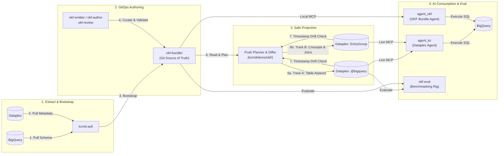

# Open Knowledge Format (OKF) & Knowledge Catalog Demo

This repository demonstrates modern metadata management for Google Cloud BigQuery and Dataplex Knowledge Catalog using the **Open Knowledge Format (OKF)**, `kcmd`, and AI agents.

It supports the full metadata lifecycle:
1. **Extract & Bootstrap (Pull)**: Extract physical table schemas and Dataplex metadata into human-readable, version-controlled OKF Markdown files in Git.
2. **Curate & Enrich (As Code)**: Define business metrics, joins, table grains, and semantic descriptions directly in code.
3. **Bi-Directional Sync & Projection (Push Planner)**: Safely project Git-authored OKF bundles into Dataplex with forward diffing, drift detection, and conflict guards.
4. **AI Consumption & Benchmarking**: Query metadata via dual ADK-powered AI agents (`agent_okf`, `agent_kc`) or benchmark retrieval accuracy (`okf-eval`).

---

## System Architecture



---

## Repository Tracks & Directory Structure

| Directory | Role | Description |
|---|---|---|
| [`bq-kc-agent/`](bq-kc-agent/) | **Consumer** | Natural language → BigQuery SQL agents built with Agent Development Kit (ADK) and FastAPI. Includes both Local OKF (`agent_okf.py`) and Dataplex KC (`agent_kc.py`) agent implementations. |
| [`kcmd/`](kcmd/) | **Core Engine** | TypeScript CLI, library, and MCP server for Knowledge Catalog. Includes `kcmd/demo/okf/` (push planner & forward differ). |
| [`okf-bundle/`](okf-bundle/) | **System of Record** | 58 production OKF v0.2 concepts (14 tables/datasets, 13 joins, 26 metrics, 3 grains, hierarchies). |
| [`okf-eval/`](okf-eval/) | **Evaluation** | Benchmarking harness (`run_arms.py`) scoring NL-to-SQL accuracy across metadata configurations. |
| [`okf-emitter/`](okf-emitter/) & [`okf-author/`](okf-author/) | **Producers** | Tools to generate joins/metrics from `spec.yaml` or author table descriptions using Gemini. |
| [`okf-review/`](okf-review/) | **Quality & CI** | Scripts for OKF v0.2 conformance, link checking, BQ schema mirroring, and frontmatter canonicalization. |
| [`docs/`](docs/) | **Documentation** | In-depth engineering docs: [`DESIGN.md`](docs/DESIGN.md), [`ARCHITECTURE.md`](docs/ARCHITECTURE.md), [`RESULTS.md`](docs/RESULTS.md), [`MEASUREMENTS.md`](docs/MEASUREMENTS.md), and [`HANDOFF.md`](docs/HANDOFF.md). |

---

## Prerequisites

- **Google Cloud Project** with BigQuery and Dataplex APIs enabled.
- **Node.js** (v18+) and npm.
- **Python 3.11+** (recommended: `uv` or `venv`).
- **Google Cloud SDK** authenticated (`gcloud auth application-default login`).
- *(Optional)* [Bun](https://bun.sh/) for running `kcmd` tests and standalone scripts.

---

## Quickstart Walkthrough

### 1. Build `kcmd`

Navigate to `kcmd` to install dependencies and compile the toolchain:

```bash
cd kcmd
npm install
npm run build:libts
npm run build:mcp
cd ..
```

*Note: To run test scenarios or compile standalone binaries, [Bun](https://bun.sh/) is supported.*

### 2. Set Up Demo Data in BigQuery

Create a demo dataset and table using public sample ecommerce data:

```sql
CREATE SCHEMA IF NOT EXISTS `YOUR_PROJECT_ID.demo_ecommerce` OPTIONS(location="US");

CREATE OR REPLACE TABLE `YOUR_PROJECT_ID.demo_ecommerce.events`
PARTITION BY event_date_dt AS
SELECT
  *,
  PARSE_DATE('%Y%m%d', event_date) AS event_date_dt
FROM
  `bigquery-public-data.ga4_obfuscated_sample_ecommerce.events_*`
LIMIT 10000;
```

---

## Workflow A: Standard Metadata Pull & Push

### Extract Metadata into OKF (`kcmd pull`)
Extract BigQuery schemas and Dataplex metadata into the local workspace:
```bash
cd bq-okf-workspace
export GOOGLE_CLOUD_PROJECT=YOUR_PROJECT_ID
export BIGQUERY_DATASET=demo_ecommerce
node ../kcmd/build/ts/tool/tool/main.js pull --format okf
cd ..
```
This populates `bq-okf-workspace/bundle/` with OKF Markdown files.

### Publish Changes (`kcmd push`)
After editing the local Markdown files, publish enrichments back to Dataplex:
```bash
cd bq-okf-workspace
node ../kcmd/build/ts/tool/tool/main.js push --format okf
cd ..
```

---

## Workflow B: Authoritative GitOps Projection & Differ (Advanced)

When your **OKF bundle in Git is the primary source of truth**, use the **Push Planner and Differ** (`kcmd/demo/okf/`) for safe, drift-aware bi-directional synchronization.

### 1. Conformance & Bundle Verification
Assert that the OKF bundle conforms to specification:
```bash
python okf-review/conformance.py
python okf-review/canonicalize.py --check okf-bundle
python okf-review/check_doc_links.py
```

### 2. Run the Differ (Drift Detection)
Inspect differences between the Git bundle and live Dataplex catalog using unforgeable server timestamps (`view=ALL`) without writing:
```bash
kcmd/node_modules/.bin/bun kcmd/demo/okf/drift.ts
# Exit codes: 0 = in sync, 1 = drift detected, 2 = error
```

### 3. Safe Planned Push (Projection)
The push planner compares timestamps and staging state first, staging only changed elements and aborting if external writes modified owned aspects:

```bash
# Track A: Project descriptions & queries onto @bigquery table entries
(cd bq-okf-workspace && ../kcmd/node_modules/.bin/bun ../kcmd/demo/okf/push-track-a.ts)

# Track B: Project non-asset concepts (joins, metrics, grain) into Dataplex EntryGroup
(cd okf-kb-workspace && ../kcmd/node_modules/.bin/bun ../kcmd/demo/okf/push.ts)
```

---

## Workflow C: Running the AI Agents (`bq-kc-agent`)

The `bq-kc-agent` module provides two specialized agent implementations comparing different metadata access patterns:

1. **Local OKF Bundle Agent (`agent_okf.py`)**: Directly reads version-controlled OKF markdown files via `kcmd` MCP server without requiring live Dataplex API calls.
2. **Dataplex Knowledge Catalog Agent (`agent_kc.py`)**: Interactively queries live Google Cloud Dataplex Knowledge Catalog entries and aspects via `@toolbox-sdk/server` MCP server.
3. **Full Reference Agent (`agent.py`)**: Comprehensive SQL generation agent equipped with domain guards (chasm/fan traps, `QUALIFY` clauses, and cohort averages).

### 1. Configure Environment
```bash
cd bq-kc-agent
cp .env.example .env
```
Edit `.env` and configure:
```env
GOOGLE_GENAI_USE_VERTEXAI=true
GOOGLE_CLOUD_PROJECT=YOUR_PROJECT_ID
GOOGLE_CLOUD_LOCATION=us-central1
BIGQUERY_DATASET=YOUR_DATASET_ID
```

### 2. Install Dependencies
Using `uv` (recommended) or `pip`:
```bash
cd bq-kc-agent
uv sync
```

### 3. Run Side-by-Side Smoke Test
Compare both agents on the same natural language query:
```bash
uv run python smoke_test_agents.py
```

### 4. Start Agent API / A2A Servers
Each agent can be served as a standalone FastAPI & Agent-to-Agent (A2A) protocol server:

```bash
# Start Agent 1 (Local OKF Bundle Agent) on port 8000
uv run python -m app.fast_api_okf

# Start Agent 2 (Dataplex KC Agent) on port 8001
uv run python -m app.fast_api_kc

# Start Reference Agent on port 8000
uv run python -m app.fast_api_app
```

Interactive OpenAPI docs and Web UI:
- Local OKF Agent UI: `http://localhost:8000/docs`
- Dataplex KC Agent UI: `http://localhost:8001/docs`

### 5. Running with Docker
```bash
# Build the Agent container image
docker build -t bq-kc-agent -f bq-kc-agent/Dockerfile .

# Run the container with ADC credentials
docker run -p 8080:8080 \
  -e GOOGLE_CLOUD_PROJECT=YOUR_PROJECT_ID \
  -e BIGQUERY_DATASET=YOUR_DATASET_ID \
  -e GOOGLE_APPLICATION_CREDENTIALS=/gcp/creds/application_default_credentials.json \
  -v $HOME/.config/gcloud:/gcp/creds:ro \
  -v $(pwd)/bq-okf-workspace:/code/bq-okf-workspace \
  bq-kc-agent
```

### 6. Deploy Agent to Vertex AI Agent Engine
```bash
cd bq-kc-agent
gcloud config set project YOUR_PROJECT_ID
agents-cli deploy
```

---

## Benchmarking & Evaluation (`okf-eval`)

To evaluate the impact of different metadata representations on NL-to-SQL retrieval accuracy across experimental arms:

```bash
python okf-eval/run_arms.py --questions okf-eval/questions.yaml --model gemini-2.5-flash
```

For empirical findings and methodology across experimental phases, see:
- [`docs/DESIGN.md`](docs/DESIGN.md): The ownership model, differ, and defect taxonomy.
- [`docs/RESULTS.md`](docs/RESULTS.md): Key findings and benchmark scores.
- [`docs/MEASUREMENTS.md`](docs/MEASUREMENTS.md): Append-only evidence log.
- [`docs/HANDOFF.md`](docs/HANDOFF.md): Operational guide and GCP resource inventory.
