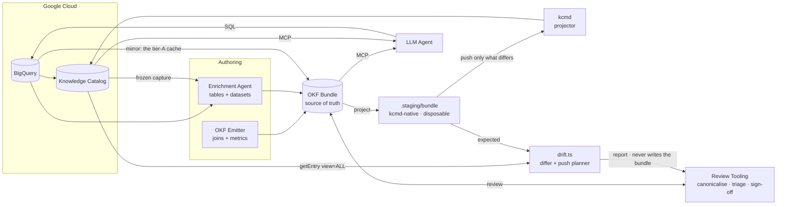
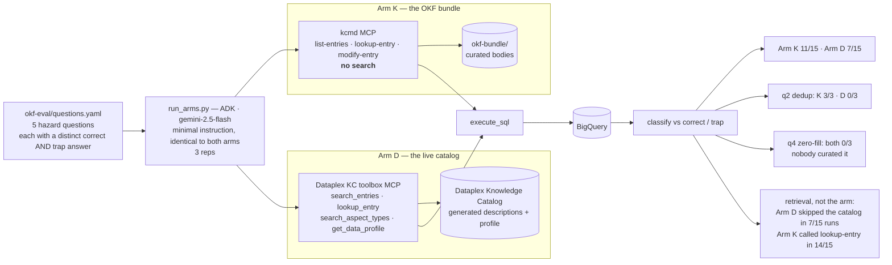

# ARCHITECTURE — `v6z-okf-projector`

The **upstream demo** was one CLI and one bundle: `pull` → enrich → `push`. This
branch keeps that spine and adds five things around it — a **frozen capture** to
ground authoring, **two producers** that write the bundle, a **review surface**
between authoring and projection, a **forward differ** that reports when the
catalog stops matching, and a **measurement harness** that reads the result
back. This file is the as-built picture; the [README](../README.md) is the
index.

§3 below compares the two directly. The upstream demo's Cloud Run sync service
and its ADK agent application are **still here and untouched** — but neither was
exercised in any measurement on this branch, so nothing in RESULTS or
MEASUREMENTS should be read as covering them. DESIGN §8.4 sets out what the push
planner does and does not take over from the sync service.

Read [RESULTS.md](RESULTS.md) for what the measurements concluded,
[MEASUREMENTS.md](MEASUREMENTS.md) for the raw evidence, and
[HANDOFF.md](HANDOFF.md) for how to run any of it.

---

## 1. The projection pipeline

The **enrichment agent** and the **emitter** are two producers, deliberately:
the emitter is deterministic and owns joins/metrics, the agent is an LLM and
owns tables/datasets. Every concept records which one wrote it.

**`.staging/bundle/` is the interface, and kcmd never sees `okf-bundle/`.** The
staged tree is a kcmd-NATIVE OKF bundle — the same object, the `x-kcmd` key,
`layout: okf` — so an unmodified kcmd can consume it, which is what closes the
`index.md` gap using kcmd's own synthesiser. It is disposable, gitignored and
deleted on exit: **no stash in the source; the stash is a build artifact.**

**The loop is no longer symmetric, and that is the design.** The push is a full
replace. The return leg is not a second writer but the **same interface with a
different last hop**: `drift.ts` builds `expected` with the very function the
push uses, reads `actual` at `view=ALL`, and emits a **report**. It compares
forward, in the catalog's shape, so there is no reverse mapping to be lossy —
and it cannot write into `okf-bundle/`, because the code that could was deleted.

The one arrow that does write the bundle from outside is **the mirror**, and it
runs from BigQuery rather than from the catalog: a field-scoped refresh of the
tier-A cache (`# Schema` types, `# Data characteristics`) that never touches an
authored field.

### What each arrow costs you

| Hop | The thing that is easy to get wrong |
|---|---|
| 2. freeze | The LLM-backed half of a capture is **not** reproducible — two runs over byte-identical data gave 18 joins then 12, two direction-flipped. Freezing is what makes everything downstream comparable. |
| 3b. author | Stock `BigQuerySource` sees **no Dataplex metadata at all**. `KCBigQuerySource` is the subclass that merges `kc-capture/` into `read_concept`. |
| 4a. push | `push --validate-only` is **not** a dry run in this fork — it creates every entry it "validates". |
| 4a. push | The aspect write is a **full replace**, not a merge. A field deleted from the bundle is deleted from the catalog. That is what makes the bundle authoritative. |
| 4a. push | Both pushes are **planners**: pull → compare → stage only what differs, and **abort entirely** if an owned channel was written by something else since the last sweep. A second run writes nothing at all. |
| 4a. push | Running an **unmodified** kcmd here is safe for entries and aspects and **destroys the link layer** — undeclared `entryLinks:` makes the reconciler's lookup unfiltered. |
| 5. diff | `drift.ts` does **not** use `kcmd pull`: the client discards `Entry.updateTime` and every per-aspect timestamp, which are the only drift evidence nothing can forge. |
| mirror | Refreshes Type and Mode **keyed on column name** and never touches a Description. A new warehouse column is flagged undocumented, not blank-filled. |
| review | The canonicaliser is a **required post-authoring step** — `reference_agent` writes non-canonical frontmatter every time. |

### Three things that did not survive the round trip — two now fixed

- ~~**`index.md` × 6**~~ **FIXED, and it was never a catalog limitation.** It
  was documents-layout only: `OkfLayout` synthesises a directory entry per
  folder and regenerates the listings in `finalize()`. Switching the staged tree
  to `layout: okf` produced **7 index entries**, live.
- **Duplicate tags** — Dataplex stores tags as a label *map*. Still true.
- ~~**The body**~~ **FIXED at source** (kcmd defect 2), though the round trip is
  no longer on the critical path: the differ compares forward and `pull.ts` is
  deleted.

---

## 2. The Phase 8 evaluation harness

Not in the upstream diagram at all. Two arms over the **same** warehouse and the
**same** deliberately minimal instruction; the metadata channel is the only
intended variable.

**The confound is load-bearing and is reported, not buried.** Arm K's MCP has no
search; Arm D's does. That is a property of the two MCP servers, not of the
metadata behind them — so the score gap is *not* evidence for OKF. The claim the
evidence actually supports is narrower: a thin tool surface that **forces**
retrieval beat a rich one that **permits** skipping it.

---

## 3. What changed relative to the upstream demo

| README diagram | This branch |
|---|---|
| `kcmd CLI` pulls BQ + Dataplex straight into the bundle | A **frozen, hash-manifested capture** (`kc-capture/`) sits in between, because the relationship scan is non-deterministic |
| One enrichment step: "Data Steward or AI" | **Two producers with recorded provenance** — a deterministic emitter for joins/metrics, an LLM author for tables/datasets — and the bundle records which wrote each concept |
| Bundle → `kcmd` → Catalog | Same spine, but through **our shim** (`kcmd/demo/okf/`) and a **kcmd-native staged tree** in between; `kcmd/src/` is patched, 8 defects fixed at source |
| — | A **review surface**: canonicaliser, join triage against JT1–JT4, and a half-flagged sign-off whose unflagged half is the control |
| — | **Two projection tracks**: Track B (concepts into a new EntryGroup) and Track A (the `okf` aspect onto the existing `@bigquery` entries) |
| — | **A read-back loop** — the forward differ, the canonical diff, the re-scan — which is where every finding came from |
| — | **A mirrored tier**: the bundle caches what the warehouse authors, computed from BigQuery, never pushed back |
| Cloud Run `kcmd-sync-service` automates pull/push | **Present but never exercised here** — every run was manual and single-writer, so no measurement on this branch covers it. Multi-writer conflict is handled by the differ and the push planner instead (DESIGN §8.3), which is why DESIGN §8.4 argues the service's job has moved. That argument is not a measurement, and the code stands until its owner decides otherwise. |
| `bq-kc-agent` is the consuming ADK agent | **Present, and deliberately not reused as the eval agent**: its system prompt ships ten hand-written modelling rules — fan traps, de-duplication, zero-fill cohorts, SCD2 — which are exactly the knowledge the bundle is supposed to supply. Reusing it would have answered the questions from the prompt and measured nothing. `okf-eval/run_arms.py` uses a minimal instruction instead. That is a statement about what makes a valid control, not about the agent's quality. |

---

## 4. The failure mode this architecture is shaped around

> **Silent plausible success.** Fork defect 1 produced a `push` that reported
> success over an empty index. Fork defect 2 produced a `pull` that returned 53
> concepts with empty bodies. The same defect on the read path produced a
> **scored agent arm** that read an empty catalog and lost a question.

Three times the system reported success and the output looked reasonable.
Nothing failed loudly. Every one was caught only by **counting something** —
which is why the diagram above has a read-back loop rather than just a push.
